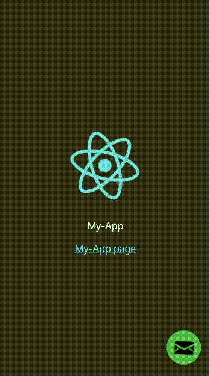

# React Floating Mailbox

`react-floating-mailbox` is a React component that renders a floating mailbox button on your page. When the button is clicked, it opens a modal that allows users to send an email using EmailJS.

[](https://www.npmjs.com/package/react-floating-mailbox)
[](https://www.npmjs.com/package/react-floating-mailbox)
[](https://www.npmjs.com/package/react-floating-mailbox)
[](/LICENSE)

<p align="center">
  
</p>

## Installation

To install react-floating-mailbox, run the following command:

```sh
npm install react-floating-mailbox
```

## Usage

To use `react-floating-mailbox`, simply import the `FloatingMailbox` component and render it in your React app:

```jsx
import React from 'react';
import FloatingMailbox from 'react-floating-mailbox';

function App() {
  return (
    <div>
      <h1>My App</h1>
      <FloatingMailbox
        serviceId="YOUR_EMAILJS_SERVICE_ID"
        templateId="YOUR_EMAILJS_TEMPLATE_ID"
        userId="YOUR_EMAILJS_USER_ID"
        to="recipient@example.com"
        subject="Hello from react-floating-mailbox"
      />
    </div>
  );
}
```

In the example above, we're passing the following props to the `FloatingMailbox` component:

- `serviceId`: The ID of the EmailJS service you want to use.
- `templateId`: The ID of the EmailJS email template you want to use.
- `userId`: The ID of your EmailJS user account.
- `to`: (Optional) The email address to send the email to. If omitted, the user will be prompted to enter an email address.
- `subject`: (Optional) The default subject for the email. If omitted, the user will be prompted to enter a subject.

## Contributing

Contributions to `react-floating-mailbox` are always welcome! If you have an idea for a new feature or improvement, feel free to open an issue or submit a pull request.

## License

`react-floating-mailbox` is licensed under the [MIT License](/LICENSE)
